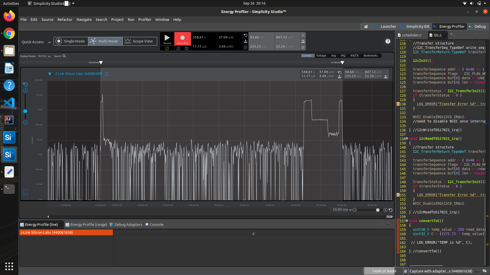

Please include your answers to the questions below with your submission, entering into the space below each question
See [Mastering Markdown](https://guides.github.com/features/mastering-markdown/) for github markdown formatting if desired.

*Be sure to take measurements with logging disabled to ensure your logging logic is not impacting current/time measurements.*

*Please include screenshots of the profiler window detailing each current measurement captured.  See the file Instructions to add screenshots in assignment.docx in the ECEN 5823 Student Public Folder.* 

1. What is the average current per period?
   Answer: 10.29uA
    Screenshot:  
     

2. What is the average current when the Si7021 is Powered Off?
   Answer: 2.29uA
    Screenshot:  
     

3. What is the average current when the Si7021 is Powered On?
   Answer: 255.25uA
    Screenshot:  
     

4. How long is the Si7021 Powered On for 1 temperature reading?
   Answer: 94.6ms
    Screenshot:  
     

5. Compute what the total operating time of your design for assignment 4 would be in hours, assuming a 1000mAh battery power supply?
   Answer: 80.98hrs
   
6. How has the power consumption performance of your design changed since the previous assignment?
   Answer: In Assignment 3 the Ave current per period was 150uA. currently in assignemnt 4 after using interrupt based routines the current consumption has droped down to 10.29uA. In both assignments   task performed is the same, only difference is the method used.
   
7. Describe how you have tested your code to ensure you are sleeping in EM1 mode during I2C transfers.
   Answer: As there is no get current energy mode function in the current sdk version we can not write a test case function to ensure we are in EM1 during I2C transfers. However, During I2C transfers the current used is about 4.5mA which is similar to what we observed in assignment 3 hence we can at least visually confirm that the processor is sleeping in EM1 during I2C transfers.
   

